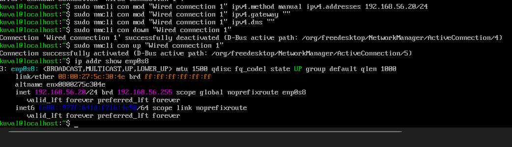
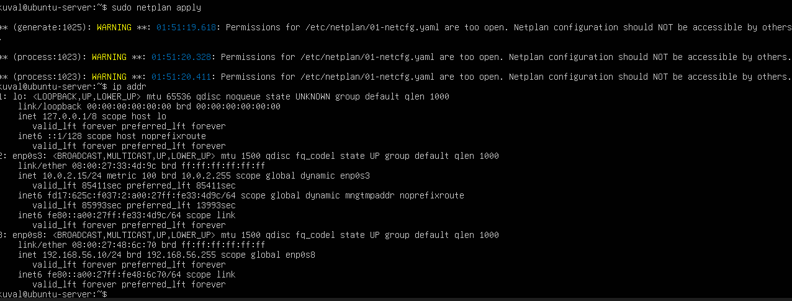

Week 1 — Phase 1: System Planning & Distribution Selection (Ubuntu vs Fedora)
═══════════════════════════════════════════════════════
SYSTEM ARCHITECTURE DIAGRAM

*Figure 1: This is a simple dual-VM architecture. Fedora workstation administers
the Ubuntu headless server via SSH over the host-only network (192.168.56.0/24).*

═══════════════════════════════════════════════════════
DISTRIBUTION SELECTION JUSTIFICATION
Chosen server distro: Ubuntu Server 24.04.3 LTS
Alternative compared against: Fedora server 43

- Package manager:
Ubuntu uses apt, which is widely documented and stable for LTS environments.
Fedora uses dnf, which supports newer packages but updates more frequently.

- Default MAC:
Ubuntu uses AppArmor by default, which provides profile-based mandatory access control.
Fedora uses SELinux in enforcing mode by default, offering fine-grained MAC at the cost of higher complexity.
(Has been verified using 'sestatus', Figure 7)

- Default firewall tooling:
Ubuntu uses UFW as a simplified frontend to iptables/nftables.
Fedora uses firewalld with zone-based configuration.

- Update cadence / stability:
Ubuntu LTS prioritises long-term stability and predictable updates.
Fedora follows a rapid release model with newer kernels and packages.

- Default running services: Verified using systemctl list-units --type=service --state=running on both systems.

My final decision and why:
I decided to use Ubuntu Server 24.04 LTS as the primary server platform
due to its long-term support lifecycle predictable updates, extensive documentation, 
and simpler security management using AppArmor,
making it more suitable for a stable server.

═══════════════════════════════════════════════════════
WORKSTATION CONFIGURATION DECISION
Option chosen (A host + SSH / B Linux desktop VM / C hybrid): C — Linux workstation VM (Fedora 43 Server, CLI)

Why this satisfies the SSH-only administration constraint: 
All administration of the Ubuntu server was performed remotely over SSH from a separate Fedora workstation VM.
The Ubuntu server remained headless with no graphical environment installed, enforcing secure remote administration.

NETWORK CONFIGURATION DOCUMENTATION

VirtualBox adapters for server VM: Adapter1 NAT, Adapter2 Host-only (VirtualBox Host-Only Ethernet Adapter)
Host-only network: 192.168.56.0/24 (DHCP OFF)
Server host-only IP: 192.168.56.10/24
Workstation host-only IP (if Linux VM/WSL): 192.168.56.20/24

*Figure 2: Fedora workstation host-only interface (enp0s8) configured with static IP 192.168.56.20/24, enabling controlled SSH administration of the Ubuntu server.*

Connectivity tests evidence: ping + SSH
ping -c 4 192.168.56.10
ssh kuval@192.168.56.10

*Figure 3: Host-only network interface configured with static IP 192.168.56.10/24, confirming correct VirtualBox host-only networking.*

*Figure 4: Successful SSH connection from Fedora workstation (192.168.56.20) to Ubuntu server (192.168.56.10), confirming host-only networking and remote administration over SSH.*

═══════════════════════════════════════════════════════
SYSTEM SPECIFICATIONS (run on server + workstation, paste outputs)
SERVER:

uname -a

Linux ubuntu-server 6.8.0-90-generic #91-Ubuntu SMP PREEMPT_DYNAMIC Tue Nov 18 14:14:30 UTC 2025 x86_64 x86_64 x86_64 GNU/Linux

free -h
              total        used        free      shared  buff/cache   available
Mem:           1.9Gi       326Mi       1.5Gi       1.0Mi       201Mi       1.6Gi
Swap:          2.0Gi          0B       2.0Gi

df -h

Filesystem                         Size  Used Avail Use% Mounted on
tmpfs                              197M  1.1M  196M   1% /run
/dev/mapper/ubuntu--vg-ubuntu--lv   14G  4.6G  8.5G  35% /
tmpfs                              984M     0  984M   0% /dev/shm
tmpfs                              5.0M     0  5.0M   0% /run/lock
/dev/sda2                          2.0G  100M  1.7G   6% /boot
tmpfs                              197M   12K  197M   1% /run/user/1000

ip addr

1: lo: <LOOPBACK,UP,LOWER_UP> mtu 65536 qdisc noqueue state UNKNOWN group default qlen 1000
    link/loopback 00:00:00:00:00:00 brd 00:00:00:00:00:00
    inet 127.0.0.1/8 scope host lo
       valid_lft forever preferred_lft forever
    inet6 ::1/128 scope host noprefixroute
       valid_lft forever preferred_lft forever

2: enp0s3: <BROADCAST,MULTICAST,UP,LOWER_UP> mtu 1500 qdisc fq_codel state UP group default qlen 1000
    link/ether 08:00:27:33:4d:9c brd ff:ff:ff:ff:ff:ff
    inet 10.0.2.15/24 metric 100 brd 10.0.2.255 scope global dynamic enp0s3
       valid_lft 84722sec preferred_lft 84722sec
    inet6 fd17:625c:f037:2:a00:27ff:fe33:4d9c/64 scope global dynamic mngtmpaddr noprefixroute
       valid_lft 86237sec preferred_lft 14237sec
    inet6 fe80::a00:27ff:fe33:4d9c/64 scope link
       valid_lft forever preferred_lft forever

What this tells me:
This shows me that the server has a functioning network interface (enp0s3) using NAT with a dynamically assigned IPv4 address,
confirming network connectivity required for SSH administration.

lsb_release -a

No LSB modules are available.
Distributor ID: Ubuntu
Description:    Ubuntu 24.04.3 LTS
Release:        24.04
Codename:       noble

What this tells me:
The system is running Ubuntu Server 24.04.3 LTS (Noble), confirming a long-term support release suitable for a stable and secure server environment.

WORKSTATION:
uname -a 
Linux localhost.localdomain 6.17.1-300.fc43.x86_64 #1 SMP PREEMPT_DYNAMIC Mon Oct 6 15:37:21 UTC 2025 x86_64 x86_64 x86_64 GNU/Linux

free -h
total        used        free      shared  buff/cache   available
Mem:            1.9Gi       320Mi       1.4Gi        8Mi       210Mi       1.6Gi
Swap:           2.0Gi          0B       2.0Gi

df -h
Filesystem                         Size  Used Avail Use% Mounted on
/dev/mapper/fedora-root             14G  4.2G  8.7G  33% /
tmpfs                              980M     0  980M   0% /dev/shm
tmpfs                              5.0M     0  5.0M   0% /run/lock
/dev/sda2                          2.0G  150M  1.7G   8% /boot
tmpfs                              196M   12K  196M   1% /run/user/1000

ip -br addr
lo        UNKNOWN   127.0.0.1/8 ::1/128
enp0s3    UP        10.0.2.15/24 fd17:625c:f037:2:a00:27ff:fe74:cf3b/64 fe80::a00:27ff:fe74:cf3b/64
enp0s8    UP        192.168.56.20/24 fe80::977f:641d:f716:4e90/64

lsb_release -a OR cat /etc/os-release
NAME="Fedora Linux"
VERSION="43 (Server Edition)"
ID=fedora
VERSION_ID=43
PRETTY_NAME="Fedora Linux 43 (Server Edition)"

What this tells me: This confirms the workstation runs Fedora Server 43 with kernel 6.17.1.
It uses dnf5 for package management, has 1.9 GiB RAM and a 2 GiB swap partition.
The host-only interface enp0s8 (192.168.56.20/24) connects securely to the Ubuntu server (192.168.56.10) over SSH, while enp0s3 handles external connectivity via NAT.
The system is correctly configured for remote administration of the Ubuntu headless server.
═══════════════════════════════════════════════════════
UBUNTU vs FEDORA EXPLORATION EVIDENCE (Lab link)
Ubuntu:
apt --version
systemctl list-units --type=service --state=running | head
ls -l /

*Figure 5: Ubuntu evidence showing APT version, sample running services, and root directory listing for comparison against Fedora.*

Fedora:

*Figure 6: Fedora Server 43 booted successfully and logged in as user `kuval`, confirming correct installation for comparison testing.*

dnf --version
systemctl list-units --type=service --state=running | head
ls -l /

*Figure 7: Fedora package manager `dnf` version output, confirming Fedora uses DNF instead of APT.*

*Figure 8: SELinux confirmed enforcing with `sestatus`, and sample of active services using `systemctl list-units` on Fedora.*
═══════════════════════════════════════════════════════
CHALLENGES ENCOUNTERED + FIXES

Problem: Netplan produced a permissions warning when applying static IP configuration.  
Cause: The netplan YAML file had overly permissive file permissions.  
Fix: File permissions were restricted using `chmod 600`, after which netplan applied successfully.

Problem: Fedora workstation could not reach Ubuntu server over host-only network (Destination Host Unreachable).
Evidence: ping -c 4 192.168.56.10 failed from Fedora.
Cause: Host-only networking/IP config mismatch (Fedora host-only adapter/interface not on the expected 192.168.56.0/24, or the host-only adapter wasn’t correctly attached/active).
Fix: Confirmed both VMs had Adapter 2 = Host-Only, then set Fedora’s host-only interface to 192.168.56.20/24, verified Ubuntu server host-only interface is 192.168.56.10/24, then re-tested ping + SSH.
Verification: Ping succeeded and SSH login worked from Fedora to Ubuntu (ssh kuval@192.168.56.10).

═══════════════════════════════════════════════════════
COMPLETION CHECKLIST
□ Architecture diagram added
□ Ubuntu vs Fedora comparison completed with evidence
□ Host-only network configured + static IPs + SSH works
□ CLI specs captured for server + workstation

My notes: For week 1 I focused on getting the 2-VM setup working (Ubuntu and Fedora)
The issue that occured was when host-only networking did not work at first. So I
had to double check the VirtualBox adapters and set static IPs on both. 
