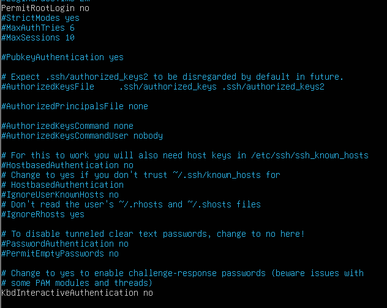
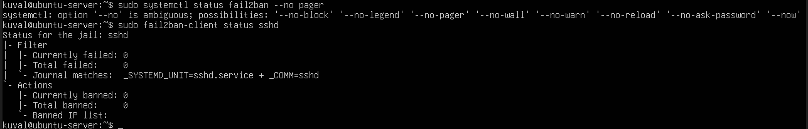

=======================================================
Week 2 — Phase 2: Security Planning & Performance Testing Methodology
═══════════════════════════════════════════════════════
PERFORMANCE TESTING PLAN (remote methodology)

Planned data table (to fill in Week 6):
Test Case | App/Workload | CPU % | RAM MB | Disk R/W | Net Mbps | Notes
Baseline idle | N/A | 4.5% (95.5% idle) | 380.9 | dd write: 813 MB/s (1GiB direct write); root FS ~37% used | N/A | TCP: 9 total (ss -s); Mem total 1967.7 MiB; buff/cache 640.8 MiB
Under load | ApacheBench (ab -n 1000 -c 50) | 4.3% (95.7% idle) | 370.8 | N/A (no disk R/W captured in this screenshot) | 413.0 | Requests/sec 4829.89; mean 10.352 ms; transfer 51624.18 KB/s ≈ 413.0 Mbps (localhost)
After optimisation | Apache MPM tuning + iperf3 validation | N/A (not captured) | N/A (not captured) | N/A | 27400 | Apache after: Requests/sec 4370.44; mean 11.441 ms; transfer 46713.33 KB/s ≈ 373.7 Mbps. Network: iperf3 [SUM] receiver 27.4 Gbits/sec ≈ 27,400 Mbps

Method:
- I will administer and monitor the Ubuntu Server remotely from the Fedora workstation using SSH over the host-only network.
- During testing weeks, I will collect metrics in three states: (1) baseline idle, (2) under load, (3) after optimisation.

Remote metric collection approach:
- Run commands from workstation like:
  ssh kuval@192.168.56.10 "<command>"
- Save outputs into timestamped files for later tables and graphs.

*Figure 1: Verification of SSH access from Fedora workstation to Ubuntu server, confirming host-only networking and remote administration.*

Planned metrics + tools (commands to be used later):
- CPU: mpstat / top
- Memory: free -h / vmstat
- Disk I/O: iostat -x / iotop
- Network: ss -s / ping / iperf3 (inside host-only network)

Evidence plan:
- Week 2: screenshot of successful SSH from Fedora → Ubuntu
- Week 6: tables + graphs built from saved outputs

No performance results are collected in Week 2; this phase defines the testing methodology and tools,
with measurements recorded during execution phases (Weeks 5–6).

═══════════════════════════════════════════════════════
SECURITY CONFIGURATION CHECKLIST (plan)

□ SSH hardening: keys-only, disable password auth, disable root login

*Figure 1: SSH server configuration on Ubuntu with root login and password authentication disabled, enforcing key-based remote access only.*

□ Firewall: allow SSH only from workstation IP (192.168.56.20), default deny inbound

sudo ufw status verbose
Status: active
Logging: on (low)
Default: deny (incoming), allow (outgoing), disabled (routed)
New profiles: skip

To                         Action      From
--                         ------      ----
22/tcp                     ALLOW IN    192.168.56.20

The Ubuntu server firewall (UFW) was configured to deny all incoming connections 
by default, allowing SSH access only from the Fedora workstation (192.168.56.20).

□ MAC: Ubuntu AppArmor (verify status), Fedora SELinux enforcing (verify with sestatus)

Ubuntu AppArmor status was verified using `aa-status`, confirming profiles are loaded and enforcing.
Fedora SELinux was verified as enforcing using `sestatus`.

□ Automatic security updates: enable unattended upgrades (Ubuntu)

Automatic security updates were enabled using `unattended-upgrades` to ensure critical security patches are applied without manual intervention.
This reduces exposure to known vulnerabilities while maintaining system stability.

□ fail2ban: protect SSH logins

Fail2Ban was installed and configured to monitor SSH authentication attempts.
The SSH jail is active and will automatically ban IP addresses that exceed the allowed number of failed login attempts.

*Figure 3: Fail2Ban service running on Ubuntu Server with the SSH (sshd) jail active, monitoring authentication attempts.*

□ User privilege management: non-root admin user, controlled sudo access

User privilege management was verified by confirming that the primary user (`kuval`) is a non-root account with controlled sudo access.
The user belongs to the `sudo` group and requires explicit privilege escalation to perform administrative tasks.
This follows the principle of least privilege.

uid=1000(kuval) gid=1000(kuval) groups=1000(kuval),4(adm),24(cdrom),27(sudo),30(dip),46(plugdev),101(lxd)

Matching Defaults entries for kuval on ubuntu-server:
    env_reset, mail_badpass, secure_path=/usr/local/sbin:/usr/local/bin:/usr/sbin:/usr/bin:/sbin:/bin

User kuval may run the following commands on ubuntu-server:
    (ALL : ALL) ALL

 
□ Network isolation: host-only for admin traffic, NAT only for updates

═══════════════════════════════════════════════════════
THREAT MODEL 

Threat 1: Brute-force SSH login attempts  
Mitigation: SSH password authentication was disabled and Fail2Ban was enabled to automatically block repeated failed login attempts.

Threat 2: Unauthorized network access to the server  
Mitigation: The Ubuntu firewall (UFW) was configured to deny all incoming traffic by default and allow SSH access only from the trusted Fedora workstation IP (192.168.56.20).

Threat 3: Privilege escalation by unauthorized users  
Mitigation: Direct root login over SSH was disabled, and administrative access is restricted to a non-root user (`kuval`) via sudo.

═══════════════════════════════════════════════════════
REFLECTION

Disabling password-based SSH authentication and enforcing firewall restrictions increases security but slightly reduces usability during initial setup.
However, the trade-off is acceptable for a server environment, as it significantly reduces the attack surface while maintaining stable remote administration.

Security vs performance/usability trade-offs anticipated:
- Restricting SSH to one IP improves security but reduces flexibility for admin access.
- fail2ban/logging improves security visibility but adds small overhead (CPU/disk writes).
- Stronger MAC enforcement improves containment but may require extra configuration to avoid blocking legitimate services.

My reflection: I planned a security and performance testing before doing the heavy 
testing. I made a decision that everything should be administered via SSH so my
evidence is inline with the brief. I wrote out the tools i would be using later 
(CPU/memory/disk) and listed the security contorls. I learned how much safer SSH becomes when 
passwords and root login are disabled.
