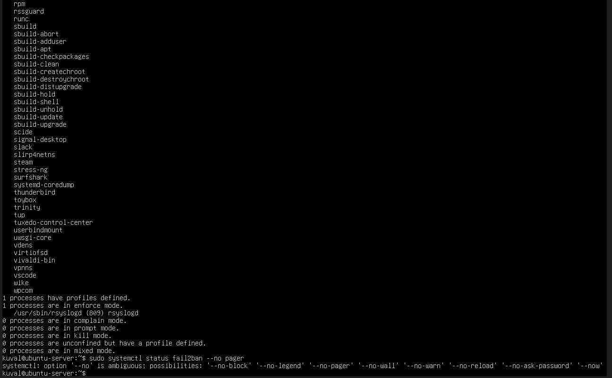

Week 5 — Phase 5: MAC, fail2ban, Automatic Updates, Scripts
═══════════════════════════════════════════════════════
MANDATORY ACCESS CONTROL
Ubuntu (AppArmor) evidence:
sudo aa-status

*Figure 1: AppArmor status on Ubuntu Server showing loaded profiles and active enforcement,
confirming mandatory access control is enabled.*

Explain enforce vs complain: Enforce mode actively blocks actions that violate security
profiles, and complain mode only logs the violations but does not prevent them.

Fedora (SELinux):
sestatus
getenforce

*Figure 2: SELinux status on the Fedora workstation showing SELinux enabled and enforcing,
providing mandatory access control for system processes.*

Explain contexts: SELinux uses security labels (contexts) on files/processes to decide what actions are allowed,
even if normal UNIX permissions would allow them.
═══════════════════════════════════════════════════════
AUTOMATIC SECURITY UPDATES
Ubuntu:
sudo apt install unattended-upgrades -y
sudo dpkg-reconfigure -plow unattended-upgrades
sudo systemctl status unattended-upgrades --no-pager

*Figure 3: Unattended upgrades service running on Ubuntu Server, confirming automatic installation of security updates.*

Trade-off (security vs stability): Automatic security updates improve security by patching vulnerabilities quickly,
but may occasionally require service restarts that can briefly affect availability.
═══════════════════════════════════════════════════════
fail2ban
sudo apt install fail2ban -y
sudo systemctl enable --now fail2ban
sudo cp /etc/fail2ban/jail.conf /etc/fail2ban/jail.local
sudo nano /etc/fail2ban/jail.local
# Enable [sshd] and set maxretry/findtime/bantime
sudo systemctl restart fail2ban
sudo fail2ban-client status
sudo fail2ban-client status sshd

*Figure 4: Fail2Ban running on Ubuntu Server with the SSH (sshd) jail enabled,
automatically banning IP addresses after a certain number of failed login attempts.
This will reduce the risk of brute-force attacks.*
═══════════════════════════════════════════════════════
SCRIPT 1: security-baseline.sh (server) 

#!/usr/bin/env bash

# security-baseline.sh
# This script performs a basic security baseline check on the Ubuntu server.
# It verifies firewall rules, SSH hardening, Fail2Ban status, and AppArmor.

echo "=== Security Baseline Check ==="

echo
echo "--- Host information ---"
hostnamectl

echo
echo "--- Firewall (UFW) status ---"
sudo ufw status verbose

echo
echo "--- SSH hardening settings ---"
sudo grep -E "PasswordAuthentication|PermitRootLogin|PubkeyAuthentication" /etc/ssh/sshd_config

echo
echo "--- Fail2Ban SSH jail status ---"
sudo fail2ban-client status sshd

echo
echo "--- AppArmor status (summary) ---"
sudo aa-status | head -n 15

*Figure 5: Output of the security-baseline.sh script, confirming firewall rules,
SSH hardening, Fail2Ban SSH jail status, and AppArmor enforcement on the Ubuntu server.*
═══════════════════════════════════════════════════════
SCRIPT 2: monitor-server.sh (workstation) -
#!/usr/bin/env bash

# monitor-server.sh
# Runs from Fedora workstation and collects performance and security stats
# from the Ubuntu server over SSH.

SERVER="kuval@192.168.56.10"
OUTDIR="$HOME/week5-logs"
TS="$(date +%F_%H-%M-%S)"
OUTFILE="$OUTDIR/monitor-$TS.txt"

mkdir -p "$OUTDIR"

echo "=== Remote Monitor Run: $TS ===" | tee "$OUTFILE"
echo "Target: $SERVER" | tee -a "$OUTFILE"
echo | tee -a "$OUTFILE"

ssh "$SERVER" '
hostnamectl
uptime
top -b -n 1 | head -n 15
free -h
df -h
ss -s
sudo ufw status verbose
sudo fail2ban-client status sshd
' | tee -a "$OUTFILE"

echo "Saved to: $OUTFILE"

*Figure 6: Output of monitor-server.sh executed on the Fedora workstation, remotely collecting CPU, memory, disk,
network, firewall, and Fail2Ban status from the Ubuntu server over SSH and saving results to a timestamped log file.*
═══════════════════════════════════════════════════════

